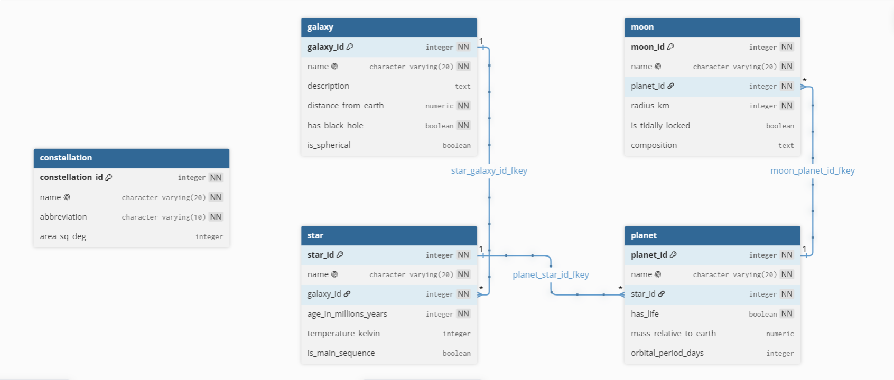

# 🌌 Celestial Bodies Database

A PostgreSQL relational database that models celestial objects and their hierarchical relationships across the universe. The project demonstrates database design principles including normalization, primary and foreign keys, one-to-many relationships, constraints, and data integrity.

## 📖 Project Overview

This database represents different types of celestial bodies and their relationships:

- A **Galaxy** contains multiple **Stars**.
- A **Star** contains multiple **Planets**.
- A **Planet** contains multiple **Moons**.
- **Constellations** are stored independently as astronomical reference data.

The project was built using PostgreSQL and demonstrates relational database modeling with properly defined keys, constraints, and sample astronomical data.

---

## 🛠 Technologies Used

- PostgreSQL
- SQL (DDL & DML)

---

## 📂 Database Structure

The database contains **5 tables**:

| Table | Description | Records |
|--------|-------------|---------|
| Galaxy | Stores information about galaxies | 6 |
| Star | Stores stars and links each star to a galaxy | 6 |
| Planet | Stores planets and links each planet to a star | 12 |
| Moon | Stores moons and links each moon to a planet | 20 |
| Constellation | Stores astronomical constellations | 7 |

---

## 🗂 Entity Relationship and ERD

```text
Galaxy
   │
   │ 1 ────────< Many
   ▼
Star
   │
   │ 1 ────────< Many
   ▼
Planet
   │
   │ 1 ────────< Many
   ▼
Moon

Constellation
(Independent Table)
```
### Entity Relationship Diagram



---

## 🔑 Relationships

| Parent Table | Child Table | Relationship |
|--------------|------------|--------------|
| Galaxy | Star | One-to-Many |
| Star | Planet | One-to-Many |
| Planet | Moon | One-to-Many |

---

## 📋 Table Details

### Galaxy

Stores galaxy information.

**Columns**

- galaxy_id (Primary Key)
- name
- description
- distance_from_earth
- has_black_hole
- is_spherical

---

### Star

Stores stars belonging to galaxies.

**Columns**

- star_id (Primary Key)
- name
- galaxy_id (Foreign Key)
- age_in_millions_years
- temperature_kelvin
- is_main_sequence

---

### Planet

Stores planets orbiting stars.

**Columns**

- planet_id (Primary Key)
- name
- star_id (Foreign Key)
- has_life
- mass_relative_to_earth
- orbital_period_days

---

### Moon

Stores moons orbiting planets.

**Columns**

- moon_id (Primary Key)
- name
- planet_id (Foreign Key)
- radius_km
- is_tidally_locked
- composition

---

### Constellation

Stores constellation reference information.

**Columns**

- constellation_id (Primary Key)
- name
- abbreviation
- area_sq_deg

---

## ✅ Database Constraints

The project includes:

- Primary Keys for every table
- Foreign Key relationships
- Unique constraints on entity names
- NOT NULL constraints where appropriate
- Auto-incrementing sequences for IDs

---

## 📊 Sample Queries

### Find all planets orbiting a specific star

```sql
SELECT p.name
FROM planet p
JOIN star s
ON p.star_id = s.star_id
WHERE s.name = 'Sun';
```

### Find all moons of Earth

```sql
SELECT m.name
FROM moon m
JOIN planet p
ON m.planet_id = p.planet_id
WHERE p.name = 'Earth';
```

### Count planets in each galaxy

```sql
SELECT
g.name,
COUNT(p.planet_id) AS total_planets
FROM galaxy g
JOIN star s
ON g.galaxy_id = s.galaxy_id
JOIN planet p
ON s.star_id = p.star_id
GROUP BY g.name;
```

---

## 🚀 How to Run

1. Install PostgreSQL.
2. Clone this repository.

```bash
git clone https://github.com/Aymen-Mohammed7/celestial-bodies-database.git
```

3. Open PostgreSQL.

4. Execute the SQL file:

```sql
\i universe.sql
```

This will:

- Create the `universe` database
- Create all tables
- Create constraints
- Insert sample data

---

## 📚 Learning Objectives

This project demonstrates:

- Relational database design
- Data normalization
- Primary and foreign keys
- One-to-many relationships
- SQL constraints
- PostgreSQL database creation
- Data insertion using SQL
- Database documentation

---

## License

This project is licensed under the [MIT License](LICENSE)

---

## 👤 Author

**Aymen Mohammed** — Data Analyst passionate about using data to tell stories and drive business decisions.

 [](https://aymenmohammed.netlify.app/)
 [](https://www.linkedin.com/in/aymen-mohammed-b1a646394)
 [](https://github.com/Aymen-Mohammed7)
